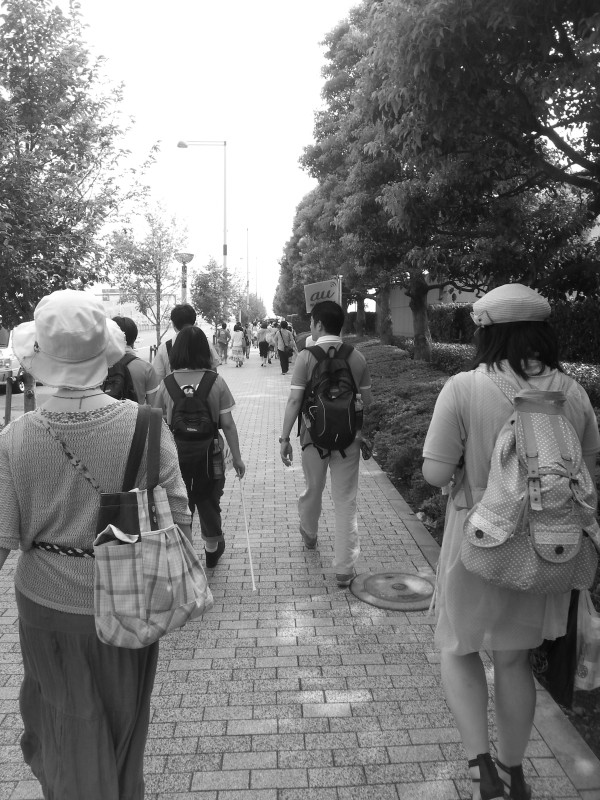

# filters

# はじめに

```bash
git submodule update --init --recursive
pushd opencv
  mkdir release
  pushd release
    cmake ..
    make -j8
    make install
  popd
popd
pushd glfags
  mkdir release
  pushd release
    cmake ..
    make -j8
    make install
  popd
popd
cmake ..
make
./filters
```

## Run

```
./filters --type blue --file /Users/hoge/img.jpg
```

## Result

```

```

# おまけ

```bash
cmake -GXcode .
```

で Xcode のプロジェクトが作成されて便利

# Result

## Original


## grayscale, blue, green, red



## meanshift


## dot, simple


## emboss, gaussianblur, sharp


## negative


